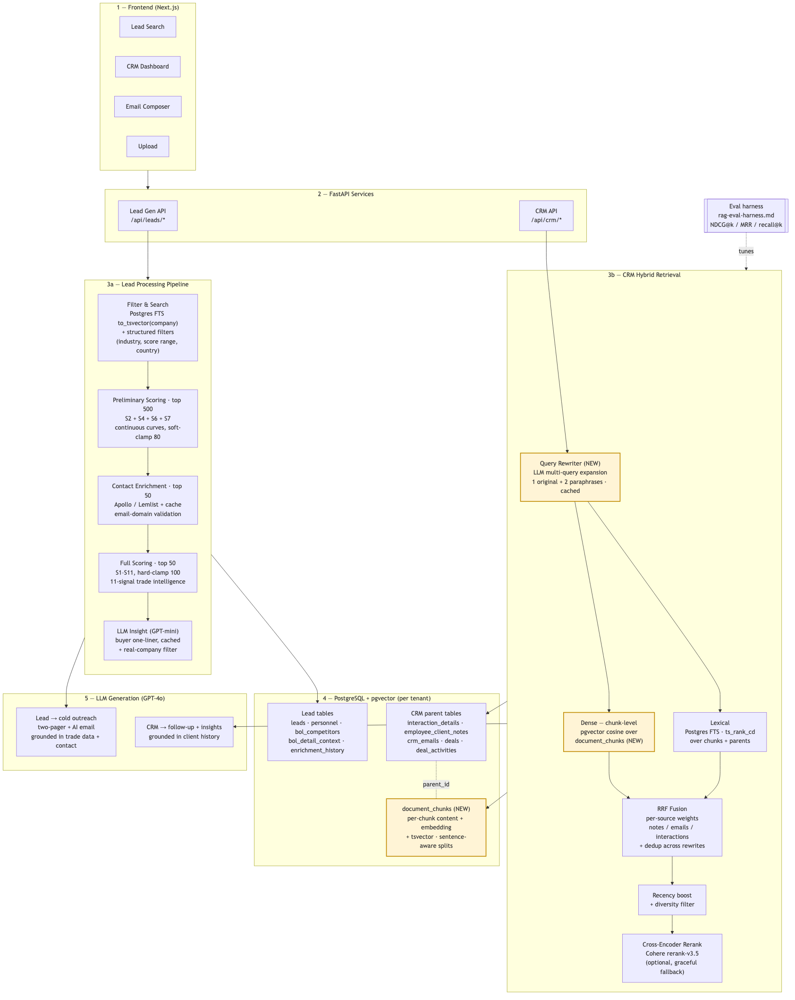
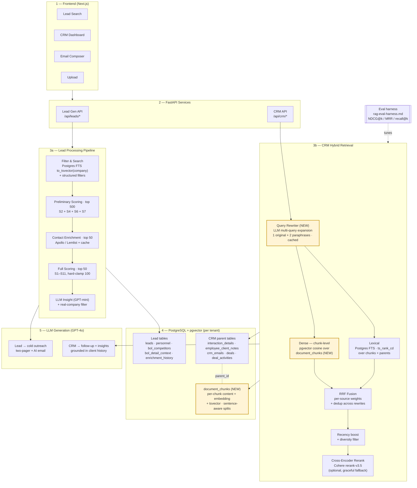

# RAG-Powered CRM — End-to-End Workflow

This is the honest, code-grounded view of how the system processes a request from
frontend to LLM output. The Lead and CRM paths share a frontend, FastAPI layer, and
Postgres+pgvector store, but their middle layers are intentionally different shapes:

- **Lead path** — small, structured, pre-curated corpus. The "intelligence" lives in
  domain scoring + LLM enrichment, not in retrieval. Search is a simple FTS filter
  on top of a hand-engineered 11-signal scoring pipeline.
- **CRM path** — large, unstructured, conversational corpus. Hybrid retrieval
  (LLM query rewriting → chunk-level dense + lexical → RRF → cross-encoder rerank)
  does the heavy lifting; generation is grounded in retrieved context.

## Diagram

Mermaid source (renders inline on GitHub / mermaid.live)

Amber-highlighted boxes (Query Rewriter, chunk-level Dense, `document_chunks`) are
the additions in this round. Everything else maps to existing code — see the
"Box → code" map below.

## What changed in this round

Two long-standing weaknesses in the CRM retrieval pipeline are now addressed:

1. **Query rewriting (multi-query expansion).** Short, ambiguous user prompts hit
   the retriever verbatim, so passages phrased differently in the corpus get missed.
   We now expand each query into the original + N paraphrases (default N=2) via a
   small LLM call, run hybrid search per paraphrase, and dedup by `(source_type,
   source_id)` keeping the max score before RRF + rerank.
2. **Chunking for long documents.** Whole-document embeddings dilute signal for
   long call transcripts and multi-paragraph emails. New writes are split with a
   sentence-aware chunker (~500-token windows, ~50-token overlap) and stored in a
   sidecar `document_chunks` table with per-chunk embeddings + tsvectors. The
   parent row's `embedding` column is preserved as a fallback so legacy
   un-chunked rows still rank.

Both features degrade gracefully:

- Rewriter falls back to the single original query if `OPENAI_API_KEY` is unset
  or the rewrite call fails.
- Chunker is no-op for short content (returns one chunk = the original text), so
  short notes and one-line emails skip the extra write.

## Box → code map

### Lead Processing Pipeline (3a)

| Box | File(s) |
|---|---|
| Filter & Search | `leadgen/data/repositories/lead_repository.py:606-612` |
| Preliminary / Full Scoring | `leadgen/importyeti/domain/scoring.py` |
| Contact Enrichment | `leadgen/importyeti/services/lead_enrichment.py` |
| LLM Insight | `leadgen/importyeti/domain/insight.py` |
| Real-company filter | `leadgen/importyeti/reports/real_company_filter.py` |
| Two-pager + outreach | `leadgen/importyeti/reports/two_pager_service.py`, `reports/email_generator.py` |

### CRM Hybrid Retrieval (3b)

| Box | File(s) |
|---|---|
| **Query Rewriter (NEW)** | `crm/services/rag/query_rewriter.py` |
| **Chunker (NEW, write path)** | `crm/services/rag/chunking.py`, `embedding_sync_service.py:_write_chunks` |
| **`document_chunks` table (NEW)** | `crm/data/migrations/003_document_chunks.sql` |
| Dense (pgvector cosine) | `crm/services/rag/context_retriever.py:_search_*` |
| Lexical (Postgres FTS `ts_rank_cd`) | `crm/services/rag/context_retriever.py:_search_*` |
| RRF Fusion + per-source weights + rewrite dedup | `crm/services/rag/context_retriever.py:retrieve_context` |
| Recency boost + diversity filter | `crm/services/rag/context_retriever.py` |
| Cross-encoder rerank | `crm/services/rag/rerank_service.py:1-40` |
| Eval harness | `crm/doc/rag-eval-harness.md` |

## Why the two halves look different

The Lead corpus is a small, structured set of buyer records that's already
pre-scored on 11 trade-intelligence signals. Free-text search over it is mostly a
filter, not a ranker — the order is computed deterministically from domain
features. Throwing dense embeddings + cross-encoders at it would replace a
deterministic, explainable ranking with a stochastic one for no measurable gain.

The CRM corpus is the opposite: thousands of free-text notes, emails, and call
transcripts where queries are short and conversational. That's exactly where
multi-query expansion + chunked hybrid retrieval + cross-encoder reranking earns
its keep.

## Follow-up work (out of scope this round)

- **Backfill** existing rows into `document_chunks`. The bulk `populate_*`
  functions in `embedding_sync_service.py` still write parent-only embeddings;
  a separate one-shot script can iterate and chunk-embed historical content.
- **Retriever-side chunk preference.** New chunks are written but the SQL in
  `_search_*` still queries parent tables. A follow-up patch should switch the
  CTE to `document_chunks` with parent rollup (`MAX(score) GROUP BY parent_id`)
  and fall back to parent embedding only when no chunks exist.
- **Eval ablation.** The harness should add three new configs: rewriter
  on/off and chunked/un-chunked, and report NDCG@10 deltas for each.
