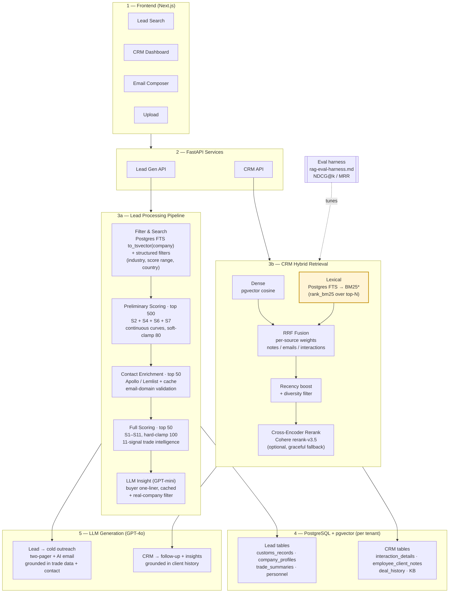

# RAG-Powered CRM — End-to-End Workflow

This is the honest, code-grounded view of how the system processes a request from
frontend to LLM output. The Lead and CRM paths share a frontend, FastAPI layer, and
Postgres+pgvector store, but their middle layers are intentionally different shapes:

- **Lead path** — small, structured, pre-curated corpus. The "intelligence" lives in
  domain scoring + LLM enrichment, not in retrieval. Search is a simple FTS filter
  on top of a hand-engineered 11-signal scoring pipeline.
- **CRM path** — large, unstructured, conversational corpus. Hybrid retrieval
  (dense + lexical → RRF → cross-encoder rerank) does the heavy lifting; generation
  is grounded in retrieved context.

## Diagram

Mermaid source (renders inline on GitHub / mermaid.live)

`*` BM25 (highlighted in amber) is the only proposed addition not yet in code.
Everything else maps to existing files — see "Box → code" map below.

## Box → code map

### Lead Processing Pipeline (3a)

| Box | File(s) |
|---|---|
| Filter & Search | `leadgen/data/repositories/lead_repository.py:606-612` |
| Preliminary / Full Scoring | `leadgen/importyeti/domain/scoring.py` |
| Contact Enrichment | `leadgen/importyeti/services/lead_enrichment.py` |
| LLM Insight | `leadgen/importyeti/domain/insight.py` |
| Real-company filter | `leadgen/importyeti/reports/real_company_filter.py` |
| Two-pager + outreach | `leadgen/importyeti/reports/two_pager_service.py`, `reports/email_generator.py` |

### CRM Hybrid Retrieval (3b)

| Box | File(s) |
|---|---|
| Dense (pgvector cosine) | `crm/services/rag/context_retriever.py:236, 433` |
| Lexical (Postgres FTS, → BM25 proposed) | `crm/services/rag/context_retriever.py:251-253, 448-450` |
| RRF Fusion + per-source weights | `crm/services/rag/context_retriever.py:242-251, 459-469` (`source_type_weights`) |
| Recency boost + diversity filter | `crm/services/rag/context_retriever.py` |
| Cross-encoder rerank | `crm/services/rag/rerank_service.py:1-40` |
| Eval harness | `crm/doc/rag-eval-harness.md` |

## Why the two halves look different

The Lead corpus is a small, structured set of buyer records that's already
pre-scored on 11 trade-intelligence signals. Free-text search over it is mostly a
filter, not a ranker — the order is computed deterministically from domain
features. Throwing dense embeddings + BM25 + cross-encoders at it would replace a
deterministic, explainable ranking with a stochastic one for no measurable gain.

The CRM corpus is the opposite: thousands of free-text notes, emails, and
transcripts where queries are short and conversational. That's exactly where
hybrid retrieval + cross-encoder reranking earns its keep.

## Proposed change: BM25 on the lexical leg

The amber-highlighted box (`Lexical → BM25*`) is the only piece not yet in code.
The cheapest way to ship it is a Python-side `rank_bm25` re-score over the top-N
FTS candidates, slotted between the SQL fetch and RRF fusion. This keeps the
Postgres FTS path as the candidate generator (so no Docker/extension change), and
the eval harness can produce a real NDCG@k delta vs. the current `ts_rank_cd`
baseline.
